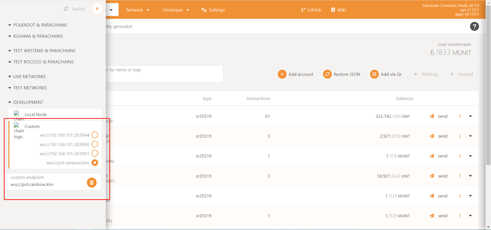
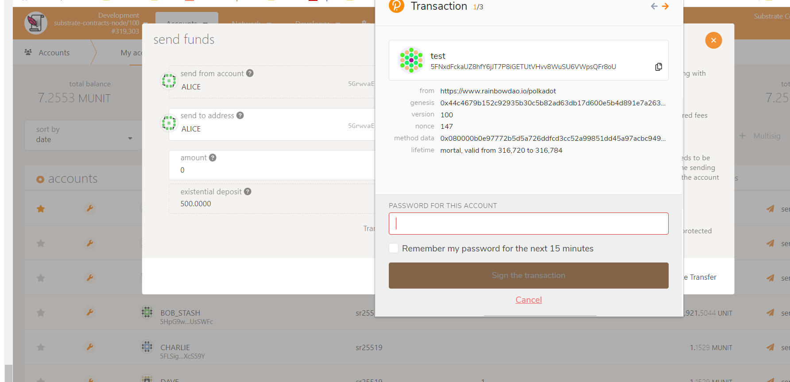
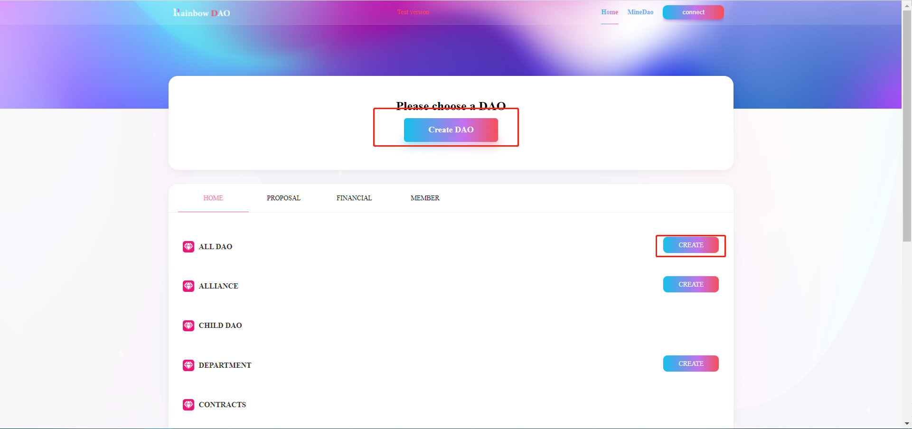
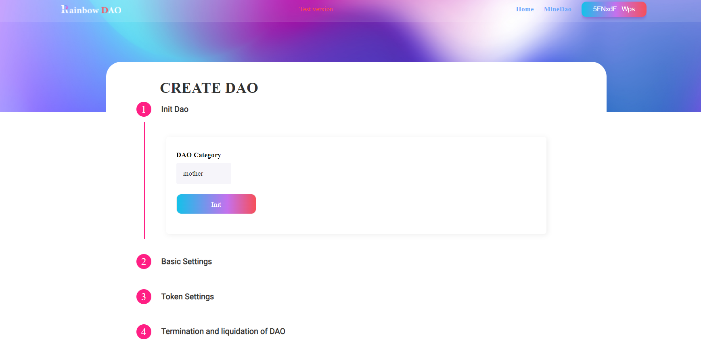
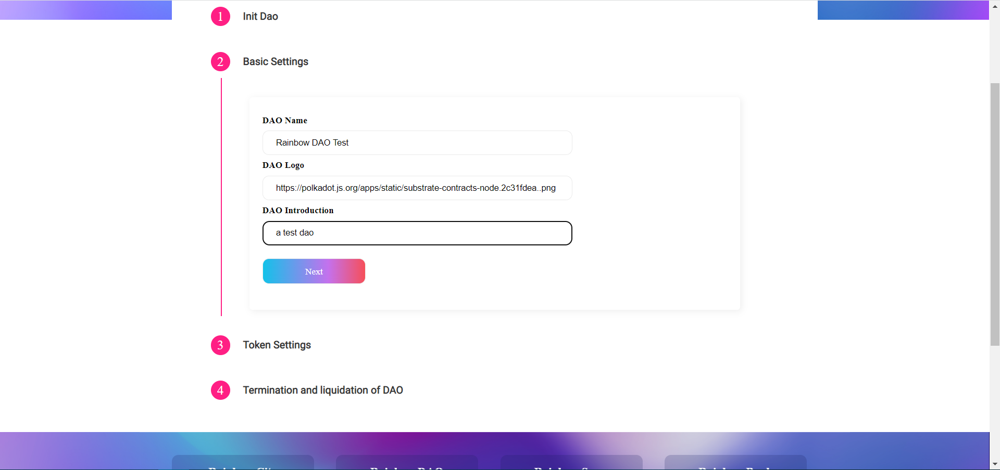
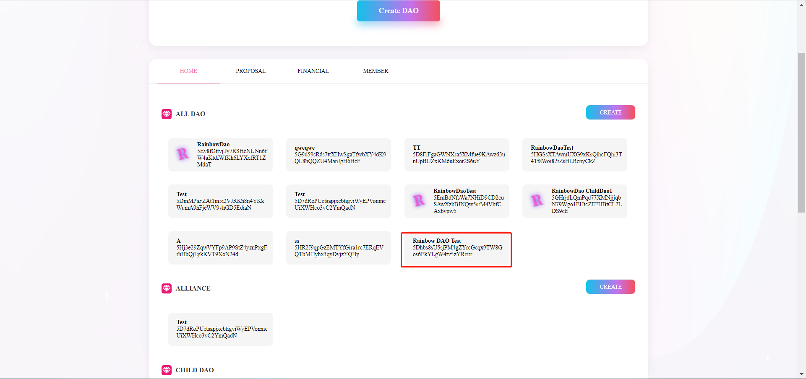
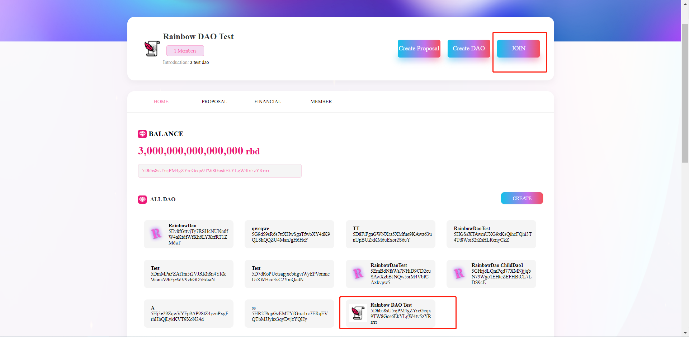
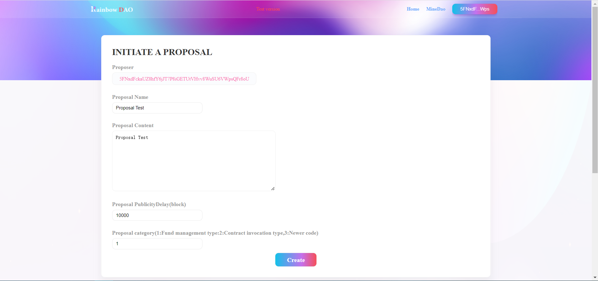
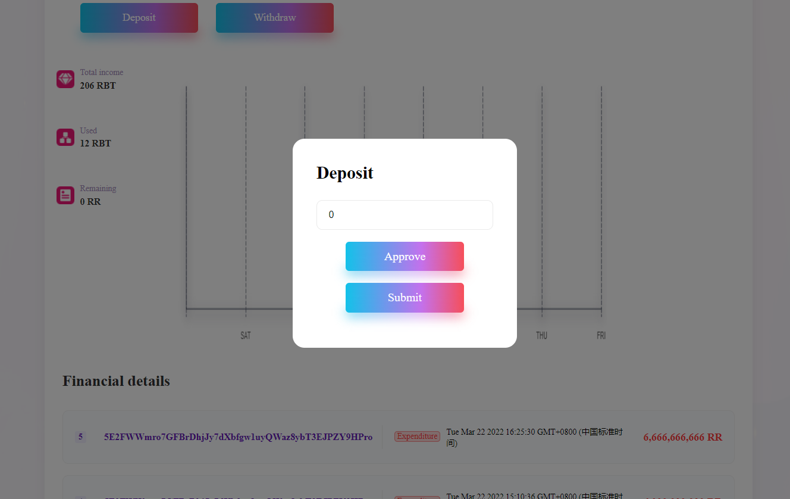
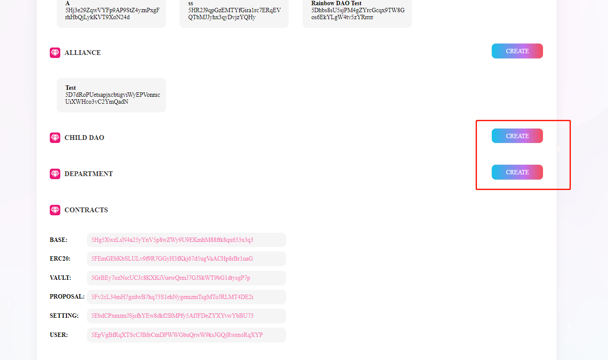

# RainbowDAO DAOFactory Ink Introduce

###  1、To get gas   

Set Node `wss://pot.rainbow.kim`

##### Get gas from ALICE

In `https://polkadot.js.org/apps` Account page, use account send gas to your extension account.

### 2、Test DAOFactory

Open https://www.rainbowdao.io/polkadot Choose DAO Factory

#### 1. Create A DAO

###### Ⅰ. Open Create DAO Page

###### Ⅱ. Set DAO Info And Create

###### Ⅲ. Choose Your DAO

#### 2. Join DAO

Select the DAO you want to join and click join

#### 3. Create Proposal

###### Ⅰ. Open Create Proposal Page

###### Ⅱ. Set Proposal Info

#### 4. Financial Management

After you choose the DAO, you can Deposit or Widraw from the DAO . 

It will be passed later through a proposal.

#### 5. Create Child DAO and Department

After you choose A DAO, you can click CREATE to create CHILD DAO or DEPARTMENT

